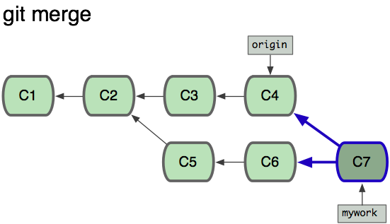

## Git命令
- **config** 配置个人信息
    - ` git config --list`
    - ` git config --global user.name "你的用户名" `
    - ` git config --global user.email "你的邮箱" `
    - ` git config --global --unset "错误的key删除掉"`

- **clone** 克隆
    - `git clone [地址]`
    - 克隆指定分支：只克隆`dev`分支
        - `git clone -b dev [地址]`
    - 不需要下载整个仓储, 只要最新的一次提交, `--depth`

- **fetch** 获取
    - 从另一个仓库下载 **对象** 和 **引用**
    - 只是把远程仓库的内容获取到本地仓库, 并没有把两者的内容进行合并

- **pull** 拉取
    - `git pull [options] [<repository>, [<refspec>...]]` : 完整格式
    - 作用是：取回远程主机某个分支的更新，再与本地的指定分支合并，它的完整格式稍稍有点复杂。`git pull`默认是`git fetch` + `git merge FETCH_HEAD`的缩写，
        - 更准确的说`git pull`使用的的是`--rebase`, 它运行`git rebase`而不是`git merge`
    - 取回`origin`主机的`next`分支, 与本地的`dev`分支合并
        - `git pull origin next:dev`
    - 如果是和当前分支合并，冒号后面的部分可以省略
        - `git pull origin next`
            - 相当于以下的两个步骤
            -  `git fetch origin` (获取远端的分支)
		    -  `git merge origin/next` （合并远端分支)
    - 默认还有远程跟踪分支的说法...        

- **push** 推送
    - `git push [地址] master`
    - `git push origin master`

- **status** 查看状态
    - `git status ` : 查看当前工作目录的状态，是已经放到暂存区，还是提交到仓库了。
    - `git status -s ` 查看简要的状态信息
     
- **log** 查看日志
    - `git log`
    - `git reflog` ：查看操作历史
    - `git log --oneline`
    - `git log –graph`  

- **stage** 暂存区
    - `git add ./file.txt`:将当前目录中的`file.txt`添加 **到暂存区**
        - `use "git add <file>..." to update what will be committed`
    - `git add .`: 表示将当前目录 **所有文件**都添加的暂存区.
    - `git checkout -- index.html`: 清空暂存区
        - `use "git checkout -- <file>..." to discard changes in working directory`

- **commit** 本地仓储
    - `git commit -m "这次我添加了一个变量" `
    - `git commit -m  -c`

- **branch** 分支
    - `git branch`: 查看有多少分支
    - `git branch -a`: 查看隐藏分支
    - `git branch dev`: 创建了一个名为dev的分支
    - `git checkout dev`: 切换到dev分支
    - `git checkout -b dev`: 创建并切换到指定分支
    - `git merge dev` 表示将当前分支与dev分支合并.  
    - `git branch -d dev` 不要在dev分支执行这个命令，在别的的分支执行.
    - `git ls-files -u` 查看冲突未处理的文件列表

- **merge** 合并

- **rebase** 变基

    

    - 基于远程分支`origin`创建`mywork`分支，你在`mywork`分支有提交，此刻`origin`分支已经有人做了修改并提交。此时，可以用`pull`把`origin`分支上的修改拉取下来和`mywork`进行合并。如下图所示：

    

    - 如果想让`mywork`分支历史看起来像没有经过任何合并一样，可以用`git rebase`, 命令如下：
        - `git checkout mywork`
        - `git rebase orgin`
    - 这些命令会把`mywork`分支里的每个提交(commit)取消掉，并且把他们临时保存为补丁(patch), 然后把`mywork`分支更新到最新的`origin`分支，最后把保存的这些补丁应用到`mywork`分支上。
        - 保存的补丁放在`.git/rebase`目录中

    

    - 当`mywork`分支更新之后，它会只想这些新创建的提交(commit), 而那些老的提交会被丢弃。如果运行垃圾收集命令(`pruning garbage collection`)，这些丢弃的提交就会被删除。        

    - ```xml
        git rebase -i HEAD~3

        pick = use commit
        reword = user commit, but edit the commit message
        edit = use commit, but stop for amending
        squash = use commit, but meld into previous commit
        fixup = like "squash", but discard this commit's message
        exec = run command (the rest of the line) using shell
        drop = remove commit

        git rebase (--continue | --abort | --skip)

        # error: cannot 'fixup' without a previous commit
    ```
    - 删除`commit`

    - 合并`commit`

    - 从指定基点创建分支

    - 合并`dev`的部分代码到`master`
    
    

- **remote** 远端分支
    - `git remote` :可以查看已添加的远程主机
    - `git remote -v`：显示所有仓库
    - `git remote add [主机名称] [远程仓库地址]`添加远程主机，即给远程主机起个别名，方便使用
    - `git remote rm [主机名称]` 命令用于删除远程主机。
    - `git remote show [主机名称]` 可以查看远程主机的信息
    - `git push origin --delete`

- **撤销**
    - **revert**
    - **stash**
        - [保存当前的工作现场](https://zhuanlan.zhihu.com/p/28608106)
        - 使用git stash保存当前的工作现场，那么就可以切换到其他分支进行工作，或者在当前分支上完成其他紧急的工作，比如修订一个bug测试提交。
    - **checkout**
    - **reset**
        - `git reset --hard <Head>` :回退到某个具体的版本。
        - `git reflog`:配合命令查看历史操作来进行回退 
        - `git rm --cached index.txt` 删除`index.txt`的跟踪，并保留在本地。
        - `git rm --f index.txt`     删除`index.txt`的跟踪，并且删除本地文件。

- `.gitignore`忽略文件
    - `.gitignore` 和 `.git`同级目录    
    - `/node_modules` 忽略某个目录
    - `/css/index.css` 忽略某个文件
    - `/css/*.css` 忽略某一类文件
    - `*.*` 忽略目录下所有文件
    - `doc/a.txt`
    - `doc/**/a.txt`
    - `#`号表示注释

#### 补充
- 如果我对某文件进行了修改，但我不想要push到远程仓库，同时我又想获取最新的修改记录
    - `git stash save`
    - `git pull --rebase`
    
- 如果暂存内容现在不想在当前分支恢复了，而是想单独起一个分支
    - `git stash branch [newBranchName]`

- 想要查看当前工作区与暂存状态内容区别
    - `git stash show -p stash{0}`

- 本地代码已经commit后，解决与远程代码冲突问题
```markdown
    # 获取远端库最新信息 【分支名称】
    git fetch origin [master]

    # 做比较
    git diff [本地分支名] origin/[远程分支名]

    # 拉取最新代码，同时会让你merge冲突
    git pull
```
   
- 和远程仓库关联
```markdown
    git init
    git add .
    git commmint -m 'init'

    将本地的仓库关联到github上
    git remote add origin https://github.com/luogeger/...
    
    上传github之前，要先pull一下
    git pull origin master
    
    最后push到远程仓库
    git push -u origin master
```

- ssh的方式
    - `ssh-keygen -t rsa` 创建密钥


- tip: 已经存在版本库了，但是要批量取消版本跟踪，但是文件不删除，怎么操作   


	
	
	 
